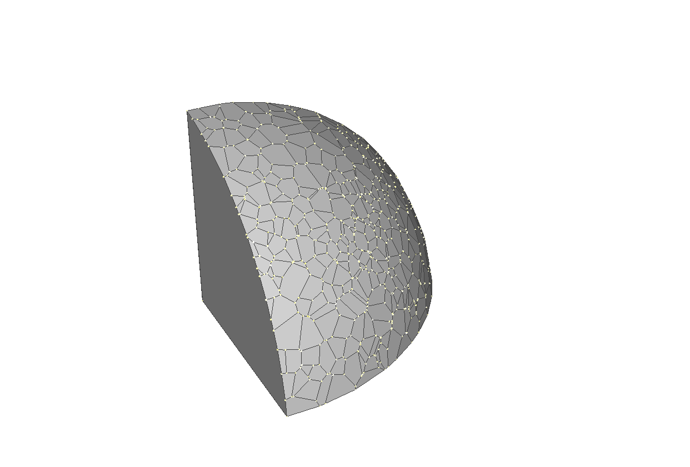
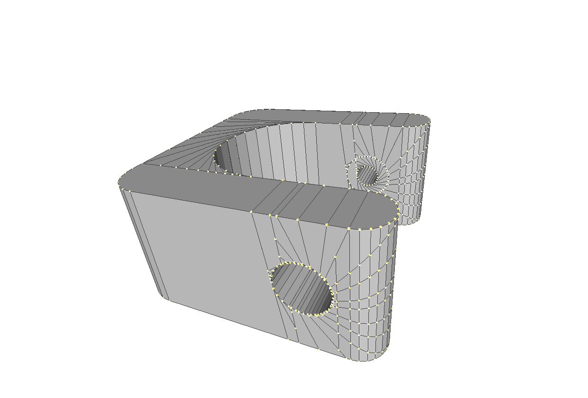

# HyperCutter

This repository contains the my personel implementation of 

> **Fast Exact Booleans for Iterated CSG using Octree-Embedded BSPs**<br/>
> Julius Nehring-Wirxel, Philip Trettner, Leif Kobbelt <br/>
> [PDF](https://arxiv.org/pdf/2103.02486)

## Screenshot
### random plane sphere cut

### mesh 2 bsp convertion

### vertical mill example

<video src="screenshot/bunny.mp4"></video>

## Compile
```shell
git clone --recursive git@github.com:quadmotor/hypercut.git
cd hypercutter
mkdir build
cd build
cmake ..
cmake --build .
```

## Usage

### random plane sphere cut
```shell
hypercuttertest.exe --randomsphere   --output  C:\tmp\hc\randoms
```
### mesh 2 bsp convertion
```shell
hypercutter.exe --mesh2bsp --input drill-trace1_1.hh.sat.obj   --output  C:\tmp\hc\randoms.obj
```
### vertical mill example
```shell
hypercutter.exe --mill --millresolution 30 --input bunny2.obj   --output  C:\tmp\hc\randoms.obj
```

